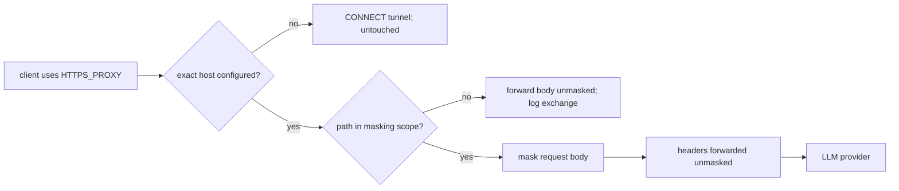

# Coverage contract

What `osm` does and does not see, in one place. The threat model
(`docs/THREAT_MODEL.md`) states the trust boundary; this document states the
mechanical coverage chain. Both are normative: a behavior change that
contradicts them is a bug or a docs defect.

## Request chain

| Axis | Rule | Source |
| --- | --- | --- |
| Transport | Only clients pointed at the proxy (`HTTPS_PROXY` etc. via `osm run` or `osm shell`). WebSocket frames and non-proxy transports are not observed. Codex and Pi currently bypass. | `cmd/osm/run.go`; `CLAUDE.md` |
| Host | Exact-host match against `proxy.DefaultProviders` + `--provider` entries. Non-matching CONNECT is tunneled byte-for-byte. | `internal/proxy/proxy.go` OnRequest HandleConnectFunc |
| Path | `Provider.Paths` regexps scope masking per host. Empty or `*` masks every path (the default for every built-in provider). Out-of-scope paths are forwarded unmasked and logged. | `internal/proxy/proxy.go` maskPath |
| Body | Decoded JSON string leaves masked; raw-byte fallback for non-JSON. Data URLs / base64-like strings skipped. Fail-closed: unmaskable body → 502. >512 MiB → 413. | `internal/proxy/proxy.go` onRequest; `internal/mask/` |
| Headers | Never masked. `Authorization` / `x-api-key` must reach the provider with the real credential. Secrets in headers for any other purpose are not protected. `Content-Length` is recalculated when the body is masked (size changes); no other header is touched. Byte-for-byte forwarding of the rest of the header set is not separately tested beyond the proxy round-trip suite. | `internal/proxy/proxy.go` onRequest |
| Opaque provider fields | Anthropic `thinking.signature` and `redacted_thinking.data` are restored byte-for-byte after masking. Matched bytes inside them stay original, on the wire and in history. | `internal/proxy/proxy.go` onRequest; `preserveOpaqueBlocks` |

## Response chain

| Case | Rule | Source |
| --- | --- | --- |
| Buffered non-SSE, secrets used | Fully reversed. 512 MiB cap; over-cap → 502. | `internal/proxy/proxy.go` onResponse |
| SSE, secrets used | Streaming reversal with bounded tail-hold; split masks across chunks are caught. | `internal/mask/reader.go`, `internal/mask/stream.go` |
| No secrets used | Response passes through unbuffered — not read into memory, not stored. | `internal/proxy/proxy.go` onResponse |
| Partial mask in output | Model echoing a mask substring is shown as-is. Provider never saw the original. UX limitation, not a leak. | `CLAUDE.md` Future TODO |

## Request history

- Stored per exchange: metadata, masked request body (when the path is in
  scope and has a body), masked buffered response body (non-SSE, only when
  the request used at least one secret), each capped at 256 KiB and
  zstd-compressed over 1 KiB.
- SSE response bodies are never stored, and a response is stored at all only
  when the exchange used a secret — see the Response chain table above.
- Bodies are post-repair: opaque-field originals can be present. Prompts,
  undetected credentials, PII, URLs, and business context can remain.
- Retention: 7 days, purged hourly by the dashboard process.
- Writes are async with a 32-write bound; a saturated queue drops the record
  and logs a warning.

## Listeners

- Proxy and dashboard bind loopback by default; non-loopback binds are
  rejected unless `--allow-external-bind` is passed (persisted across
  respawn/restart). See `docs/THREAT_MODEL.md` §3.4 for what the override
  exposes.
- The dashboard is unauthenticated, including plaintext reveal routes.

## Non-goals

`osm` is not an egress firewall, not an agent sandbox, and does not scan tool
output before it enters a conversation. Coverage planes beyond the proxy
(hooks, SDK middleware, WebSocket interception) are separate product
decisions, not extensions of this contract.
