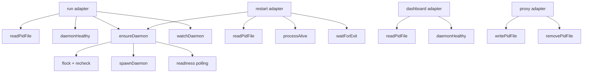
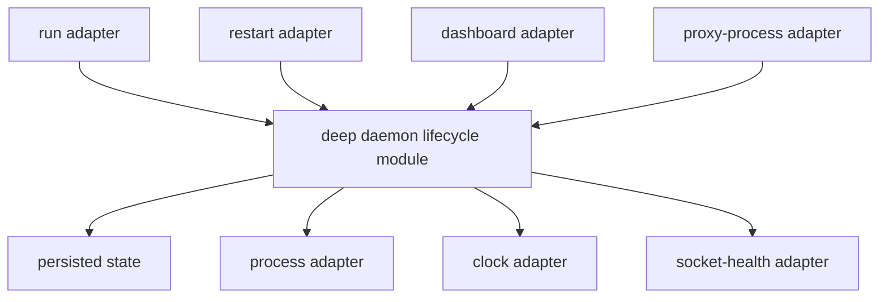

# Candidate 1: deepen the daemon lifecycle module

**Recommendation strength: Strong**

## Files

- `cmd/osm/daemon.go:25-184`
- `cmd/osm/run.go:67-102`
- `cmd/osm/run.go:187-244`
- `cmd/osm/restart.go:17-85`
- `cmd/osm/dashboard.go:11-30`
- `cmd/osm/proxy.go:103-119`
- `cmd/osm/run_test.go:15-137`

## Problem

The daemon is one domain concept, but its implementation and interface are
spread across free functions and Cobra command closures.

`daemon.go` owns persisted `pidInfo`, atomic pidfile replacement, process and
socket health, flock serialization, detached spawn, and readiness polling.
`run.go` adds prompt policy, reuse rules, inherited spawn configuration,
watchdog state, cancellation, and respawn. `restart.go` adds termination and
exit polling. `dashboard.go` performs its own discovery and health sequence.
`proxy.go` publishes and removes the pidfile.

A caller must learn this implicit interface:

1. read the pidfile;
2. validate both PID and socket;
3. decide whether a passphrase is needed;
4. inherit persisted spawn options when reusing;
5. acquire the lock and recheck health;
6. spawn and poll readiness;
7. watch the daemon while a child runs;
8. preserve addresses and configuration when respawning;
9. wait for both process exit and pidfile removal when restarting.

That interface is almost as complex as the implementation. The current module
is therefore shallow even though individual helpers are useful.

## Evidence of friction

- `ensureDaemon` mixes filesystem, flock, process creation, networking, polling,
  configuration, and timeout reporting (`cmd/osm/daemon.go:106-184`).
- `watchDaemon` duplicates discovery and health knowledge and coordinates an
  in-flight spawn with atomics and a second wait group
  (`cmd/osm/run.go:187-244`).
- `restartCmd` must know that clean exit means both a dead PID and an absent
  pidfile (`cmd/osm/restart.go:71-85`).
- `dashboardCmd` repeats read-then-health-check ordering
  (`cmd/osm/dashboard.go:21-27`).
- `proxyCmd` owns publication and cleanup of daemon state
  (`cmd/osm/proxy.go:103-119`).
- `TestWatchDaemonDrainsRespawnGoroutine` cannot observe a lifecycle transition.
  It deliberately forks the test binary, sleeps, and waits up to 15 seconds
  (`cmd/osm/run_test.go:75-137`).
- The earlier run-coverage plan explicitly left the reuse-daemon path out of
  scope (`docs/plans/run-test-coverage.md:9-18`).
- Commit `7d17bff` fixed respawn draining and cancellation ordering after the
  watchdog was added.

## Deletion test

Delete `daemon.go`.

The complexity does not vanish. Atomic pidfile writes, stale-state cleanup,
process/socket health, flock ordering, detached spawn, readiness polling, and
configuration preservation would reappear in `run`, `restart`, `dashboard`,
and `proxy`. This is a strong signal that the concept deserves a deep module.

The current file only partially passes the deletion test because callers still
own lifecycle ordering and state transitions.

## Solution

Create one daemon lifecycle module that owns the complete state protocol:

- persisted daemon identity and spawn configuration;
- discovery and stale-state cleanup;
- health evaluation;
- serialized ensure/spawn;
- readiness and exit observation;
- watch and respawn;
- restart;
- state publication and removal.

Cobra commands remain thin adapters. They translate flags, environment, and
terminal input into a lifecycle request, then render the result.

Keep process, clock, filesystem, and socket seams inside the module. Production
and deterministic test adapters make these real seams; callers should not
learn them.

Do not decide method names or parameter types yet. First grill the lifecycle
states, ownership of passphrase prompting, and whether the proxy process or the
controller publishes daemon state.

## Before

## After

## Benefits

### Locality

- All daemon state transitions and invariants change in one module.
- Address/configuration preservation cannot drift between reuse, respawn, and
  restart paths.
- Pidfile publication and cleanup become part of the same lifecycle that reads
  the file.

### Leverage

- Four command adapters use the same verified behaviour.
- Future stop, inspect, or upgrade commands reuse the module without copying
  process-state knowledge.
- One fix covers foreground control, watchdog recovery, restart, and dashboard
  discovery.

### Tests

The interface becomes the test surface. Tests can drive states such as:

- absent, malformed, stale, healthy, and PID-reused records;
- two simultaneous ensure requests;
- spawn failure and readiness timeout;
- cancellation before and during respawn;
- clean and unclean exit;
- restart preserving addresses and configuration;
- watcher shutdown with an in-flight respawn.

These tests should use deterministic process, clock, filesystem, and socket
adapters. No real fork-exec. No multi-second sleeps.

## Tradeoffs and guardrails

- Do not create separate discovery, spawn, watch, and restart interfaces for
  their own sake. That recreates the current shallow shape behind more types.
- Keep `pidInfo` encoding private unless another executable genuinely consumes
  it.
- Preserve atomic rename and flock semantics.
- Preserve the rule that an alive PID without the expected listening socket is
  unhealthy.
- Candidate 2 must not become a pass-through layer over this module. The daemon
  lifecycle controls a proxy-process runtime; it should not duplicate it.
