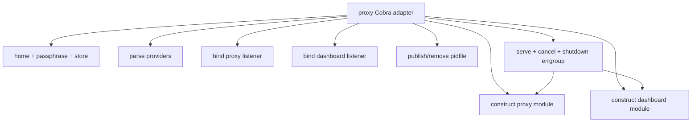
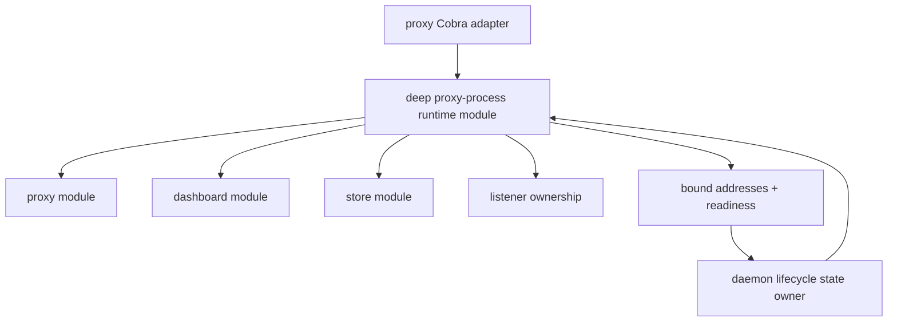

# Candidate 2: deepen the proxy-process runtime module

**Recommendation strength: Strong**

## Files

- `cmd/osm/proxy.go:30-169`
- `cmd/osm/app.go:88-123`
- `internal/proxy/proxy.go:101-120`
- `internal/dashboard/dashboard.go:39-101`
- `cmd/osm/daemon.go:149-184`

## Problem

The `proxy` Cobra adapter owns the entire proxy-process runtime inside one
`RunE` closure:

- logger construction;
- home, CA, encrypted store, detector, and masker construction;
- custom interception-policy parsing;
- proxy and dashboard listener binding;
- proxy and dashboard module construction;
- daemon-state publication and cleanup;
- signal handling;
- three goroutines;
- coordinated shutdown and error propagation.

This is not merely command parsing. It is a large implementation exposed
through Cobra's broad implicit interface: flags, environment, terminal
passphrase input, process signals, filesystem state, listeners, and output.

The `internal/proxy` and `internal/dashboard` modules are independently
testable through their handlers. Their combined process lifecycle is not.
Partial-start cleanup and shutdown ordering can only be exercised through the
command or a container.

## Evidence of friction

- Store unlocking and masker construction happen before listener ownership is
  established (`cmd/osm/proxy.go:47-63`).
- Two listeners are bound with manual rollback for the second bind
  (`cmd/osm/proxy.go:74-85`).
- Dashboard construction adds another manual cleanup branch
  (`cmd/osm/proxy.go:89-94`).
- Pidfile publication adds a third cleanup branch
  (`cmd/osm/proxy.go:103-119`).
- Serve and shutdown behaviour is embedded in an `errgroup` closure
  (`cmd/osm/proxy.go:130-161`).
- `openUnlocked` combines store construction, initialization policy,
  passphrase acquisition, unlock, and cleanup (`cmd/osm/app.go:88-114`).
- Unit tests cover proxy and dashboard modules separately, but the complete
  runtime is only reached through `osm run` integration tests.

## Deletion test

Extracting a thin wrapper around the existing `RunE` body would fail the
deletion test: deleting that wrapper would simply move the same closure back.

A deep runtime module passes only if it absorbs resource ownership, startup
rollback, serving, signal-independent cancellation, shutdown ordering, and
final cleanup. Deleting that module would then spread those invariants across
the command adapter again.

## Solution

Create one proxy-process runtime module. It should own:

- construction and ordered cleanup of the store, masker, proxy, and dashboard;
- binding and ownership of both listeners;
- reporting bound addresses and readiness to the daemon lifecycle module;
- concurrent serving;
- cancellation and bounded shutdown;
- final resource cleanup.

The Cobra command becomes an adapter for flags, environment, passphrase input,
signals, and human-readable output. Signal conversion should happen at the
adapter edge; the runtime itself should operate on caller-provided
cancellation.

Do not decide the runtime interface until candidate 1 is grilled. The daemon
lifecycle is the sole owner of persisted daemon state. The runtime only reports
readiness facts and owns process resources.

## Before

## After

## Benefits

### Locality

- Startup order, rollback, serving, and shutdown live together.
- Resource leaks caused by a failure at step N are verified beside construction
  of step N.
- Readiness facts come from an actually constructed runtime, so the daemon
  lifecycle can publish state at the correct point.

### Leverage

- Foreground `osm proxy`, detached daemon spawn, and integration tests use the
  same runtime implementation.
- Adding another local listener or background loop changes one module.
- Candidate 1 controls one process-level interface instead of reconstructing
  runtime knowledge.

### Tests

Tests should cross the runtime interface and cover:

- failure at each construction and bind step;
- cleanup after partial startup;
- one server returning an error while the other is running;
- cancellation and bounded shutdown;
- shutdown error aggregation;
- readiness reporting only after listeners are bound;
- cleanup after all serving paths exit.

## Tradeoffs and guardrails

- Keep `internal/proxy.Server` and `internal/dashboard.Server` deep. Do not leak
  their internal handlers into the runtime interface.
- Avoid a generic application framework. This runtime has one purpose.
- Avoid splitting every resource into a public adapter. Internal seams are
  sufficient for deterministic tests.
- Candidate 1 owns daemon-state publication and removal. This runtime must
  never write or remove the pidfile independently.
