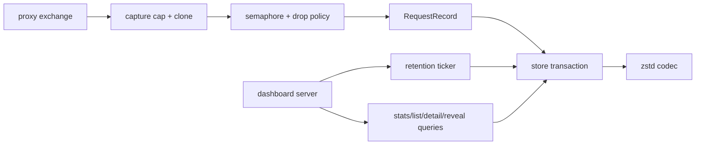
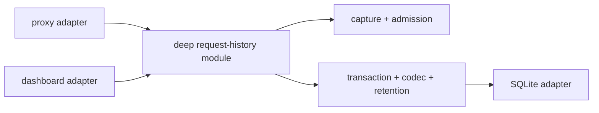

# Candidate 3: deepen the request-history module

**Recommendation strength: Worth exploring**

## Files

- `internal/proxy/proxy.go:122-149`
- `internal/proxy/proxy.go:319-409`
- `internal/store/requests.go:9-157`
- `internal/store/body_codec.go:7-72`
- `internal/dashboard/dashboard.go:29-34`
- `internal/dashboard/dashboard.go:103-126`
- `internal/dashboard/dashboard.go:216-264`

## Problem

Request history is one domain concept whose policy and implementation are
spread across three packages.

The proxy decides:

- which masked request and response bytes to capture;
- the 256 KiB body cap;
- how to build a request record;
- which secret IDs to link;
- asynchronous admission;
- a 32-write concurrency limit;
- log dropping when the queue is full.

The store decides:

- transaction shape;
- body compression threshold and codec;
- decode limits;
- request/secret linkage;
- query shapes;
- purge execution.

The dashboard decides:

- seven-day retention;
- purge-loop lifecycle;
- list limits;
- aggregation and reveal query sequences.

Changing the request-history policy therefore requires understanding transport,
persistence, and presentation code. The current `RequestRecord` is a shallow
data carrier: its fields expose nearly everything the store call needs to know,
while admission and retention remain elsewhere.

Masked bodies replace mask-eligible matches, but best-effort detection can miss
credentials. The proxy also restores Anthropic opaque fields before history
capture, so matched bytes inside those fields can be stored in original form.
Bodies retain prompts, source fragments, PII, URLs, and business context.
Capture level is therefore security and product policy, not merely a codec
detail.

## Evidence of friction

- Capture policy and cloning live in `capBody`
  (`internal/proxy/proxy.go:134-149`).
- Request/response state is accumulated in proxy-private `exchange`
  (`internal/proxy/proxy.go:122-132`).
- Record construction, secret-ID extraction, async admission, bounded
  concurrency, drop policy, and structured logging share one method
  (`internal/proxy/proxy.go:359-409`).
- Persistence compression is invisible to callers but configured in
  `internal/store/body_codec.go:7-72`.
- Transactional request/secret linkage is in
  `internal/store/requests.go:26-74`.
- Retention belongs to dashboard process lifetime
  (`internal/dashboard/dashboard.go:29-31`,
  `internal/dashboard/dashboard.go:103-126`), even though it governs stored
  history.
- Recent history required separate schema, codec, implementation, and test
  commits: `69fc302`, `38c988c`, and `240a214`.

## Deletion test

There is no single request-history module to delete today.

Delete `RequestRecord`, `capBody`, the async logging block, body codecs, or the
dashboard purge loop individually and the same complexity reappears in their
callers. The behaviour already forms a module conceptually; its seam is merely
split.

A useful deep module would make deletion spread capture, admission,
persistence, and retention policy back across proxy, store, and dashboard.

## Solution

Concentrate request-history behaviour in one module:

- proxy-exchange capture policy;
- admission and overload policy;
- persistence of masked bodies and secret links;
- encoding details;
- history query behaviour used by the dashboard;
- retention policy and purge triggering.

Keep SQLite as the sole persistence adapter. Do not add repository-shaped
interfaces while there is only one adapter.

The proxy should stop constructing storage rows and managing a write semaphore.
The dashboard should stop owning data retention. Exact caller-facing operations,
inputs, outputs, and error modes are deferred to grilling.

## Before

## After

## Benefits

### Locality

- Capture limits, queue limits, drop behaviour, encoding, and retention become
  one policy.
- Request/secret linkage and reveal-safe query shapes evolve together.
- Compression changes no longer require tracing proxy and dashboard lifecycle.

### Leverage

- Proxy, dashboard, status, and future export tooling use one history module.
- Bounded admission and observability apply to every recorder.
- One retention fix applies whether the dashboard is open or not.

### Tests

Tests should cover the module interface:

- exact capture truncation and cloning;
- mask-eligible matches are absent from persisted bodies;
- opaque Anthropic fields are excluded, separately redacted, or explicitly
  accepted as original provider data in history;
- bounded admission and explicit drop accounting;
- transactional request/secret links;
- compression and decode-limit behaviour;
- retention independent of dashboard serving;
- concurrent record and query behaviour;
- shutdown draining or intentionally dropping pending records.

## Tradeoffs and guardrails

- This candidate spans packages. Keep migration mechanical and
  behaviour-preserving before changing policy.
- Do not create separate adapters for capture, queue, codec, queries, and
  retention unless two implementations exist.
- Decide whether asynchronous loss is acceptable before hiding it. A deep
  module must make the error/drop contract smaller, not invisible.
- Preserve the rule that captured bodies contain masks, never decrypted
  originals.

## Questions for grilling

- Should metadata-only history be the default, with masked body capture enabled
  explicitly for a bounded debug window?
- Should retention be fixed, configurable, or disabled when body capture is
  off?
- Should queue saturation drop newest, drop oldest, or apply bounded
  backpressure?
- Which metrics make dropped or truncated history visible?
- Must reveal join data be captured at write time, or derived at query time?
