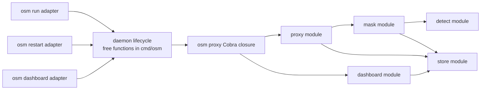

# Architecture improvement review

Review date: 2026-07-28

Snapshot: `240a2148a7eb8c0ee488a35951fa4c07e115ebd4` plus the pre-existing dirty worktree

Scope: current Go code, tests, recent 80-commit history, `CLAUDE.md`, design documents, threat model, and test audit

This review looks for **deepening opportunities**: places where more behaviour
can sit behind a smaller interface, at a cleaner seam. It deliberately does not
design new interfaces yet. That work should happen only after one candidate is
selected and its constraints are grilled.

There is no `CONTEXT.md` and there are no ADRs in this repository. Domain names
therefore follow `CLAUDE.md` and the current source: **secret**, **mask**,
**registered secret**, **detected secret**, **proxy exchange**, **daemon**,
**interception policy**, and **request history**. Older design documents are
treated as historical constraints, not proof of current behaviour.

## Executive result

| Rank | Candidate | Strength | Why now |
| ---: | --- | --- | --- |
| 1 | [Deepen the daemon lifecycle module](01-daemon-lifecycle.md) | **Strong** | Lifecycle knowledge crosses four commands; tests use real fork-exec and wall-clock waits; a lifecycle race already required a follow-up fix. |
| 2 | [Deepen the proxy-process runtime module](02-proxy-runtime.md) | **Strong** | One Cobra closure owns resource construction, two listeners, pidfile publication, concurrent serving, and shutdown. |
| 3 | [Deepen the request-history module](03-request-history.md) | **Worth exploring** | Admission, body caps, asynchronous writes, compression, retention, and presentation are spread across proxy, store, and dashboard packages. |

The external review also exposed prerequisites that are more urgent than
refactoring:

1. replace the obsolete hook-era threat model;
2. prevent either unauthenticated listener from being bound beyond loopback;
3. publish the proxy/host/path/header/transport coverage contract;
4. decide whether request bodies belong in history by default.

See [Security and product prerequisites](SECURITY-PREREQUISITES.md) for the
verified evidence. These do not change the candidate ranking: among
module-deepening options, daemon lifecycle remains first.

## Current architecture

Several modules are already deep:

- `internal/dashboard.Server` presents a small handler/serve/shutdown interface
  over templates, view models, reveal behaviour, and retention work.
- `internal/store.Store` hides SQLite, encryption, caches, transactions, and
  body codecs. Splitting it into repository-shaped adapters would create
  hypothetical seams while there is still one SQLite adapter.
- `internal/mask.Masker` hides registered-secret lookup, detection, stable mask
  creation, JSON traversal, and persistence. Provider-specific request repair
  correctly remains outside this provider-dialect-agnostic module; one caller
  and one concrete exception do not justify another module.

## Top recommendation

Start with the **daemon lifecycle module**.

It has the clearest combination of low locality and weak test surface:

- `run`, `restart`, `dashboard`, and `proxy` each know pieces of the daemon
  state protocol.
- Correct use requires ordering knowledge that is not represented by one
  interface: read state, verify process and socket, acquire the flock, recheck,
  spawn, poll readiness, persist configuration, watch, and restart.
- `TestWatchDaemonDrainsRespawnGoroutine` cannot observe the lifecycle directly.
  It forks the test binary, sleeps, and allows a 15-second deadline.
- Commit `7d17bff` fixed a wait/drain race shortly after watchdog introduction,
  evidence that behaviour is changing at the cross-function seam.

A deep daemon lifecycle module would give leverage to four command adapters and
locality to the highest-risk process-state invariants. Its deletion test is
strong: delete it and flock, pidfile atomicity, health probing, spawn, readiness,
watch, and restart logic reappear across all four callers.

## Review constraints

- Preserve fail-closed request masking.
- Preserve exact-host interception and loopback listener defaults. Do not treat
  loopback as enforced while listen-address flags accept arbitrary addresses.
- Preserve per-process trust; do not add system trust-store mutation.
- Preserve stable format-shaped masks and encrypted originals.
- Preserve the deliberate `detect.Provider` seam unless its accepted modular
  detection plan is explicitly reopened.
- Do not introduce an adapter until two behaviours actually vary at that seam.
- Keep Cobra commands as adapters, not owners of lifecycle implementation.

## Files in this review

- [01 — Daemon lifecycle](01-daemon-lifecycle.md)
- [02 — Proxy-process runtime](02-proxy-runtime.md)
- [03 — Request history](03-request-history.md)
- [Security and product prerequisites](SECURITY-PREREQUISITES.md)
- [External review assessment](EXTERNAL-REVIEW-ASSESSMENT.md)
- [Evidence and method](EVIDENCE.md)
