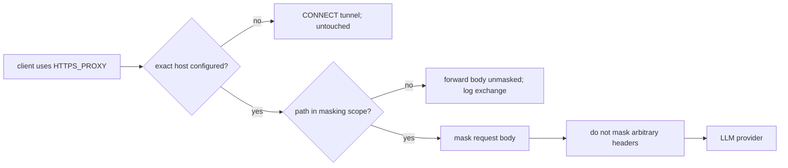

# Security and product prerequisites

These findings came from an external review and were rechecked against the
current working tree. They sit ahead of module-deepening work because they
change what users and reviewers can safely assume about the product. They are
not extra refactoring candidates.

## Verdict

The CA-MITM proxy is coherent for this specific boundary:

> One local user deliberately routes an HTTP client through `osm`, trusts the
> local CA for that process, and wants payload secrets replaced before a
> configured LLM provider receives the request body.

It is not a complete agent sandbox or general egress-control plane. The
architecture does not observe tool output before it enters a conversation, HTTP
traffic that bypasses the proxy, WebSocket frames, non-configured hosts, or
out-of-scope request paths.

## Priority

P0 means resolve before publishing or relying on a security review. P1 means
resolve before implementing the architecture candidates because it changes
their product constraints or safe defaults.

| Priority | Prerequisite | Why it precedes refactoring |
| --- | --- | --- |
| P0 | Replace the stale threat model | The published security contract describes a different product. |
| P0 | Enforce listener exposure rules | CLI overrides can create an unauthenticated general CONNECT proxy or expose plaintext-reveal routes beyond loopback. |
| P1 | Publish one coverage contract | Proxy, host, path, header, and transport exclusions are spread across source and contributor notes. |
| P1 | Decide request-history content defaults | Masked bodies still contain prompts, PII, and business data. |

## 1. Replace the stale threat model

**Status: confirmed documentation defect**

`docs/THREAT_MODEL.md` still describes the hook architecture:

- PostToolUse and PreToolUse hooks at `docs/THREAT_MODEL.md:39-46`;
- HMAC-derived masks and `install.key` at `docs/THREAT_MODEL.md:48-63`;
- plaintext `secrets.json` and `mappings.json` at
  `docs/THREAT_MODEL.md:69-84`;
- hook and container-streaming failure modes later in the document.

The current program instead opens `osm.db`, unlocks an encrypted store, creates
a local CA-MITM proxy, masks request bodies, and reverses masks in buffered or
SSE responses. See `cmd/osm/app.go:88-122`,
`internal/proxy/proxy.go:175-233`, and `internal/proxy/proxy.go:267-356`.

The replacement document should state, without relying on historical v1
terminology:

- protected assets: registered and detected secrets in mask-eligible payload
  fields;
- trusted principals: the same OS user, the running daemon, its unlocked
  process memory, and the local CA;
- protected route: proxied HTTP request bodies for exact configured hosts and
  in-scope paths;
- deliberate exclusions: authentication headers, provider-owned opaque fields,
  tunneled hosts, non-proxy transports, WebSocket frames, and out-of-scope
  paths;
- at-rest facts: encrypted originals, plaintext masks, masked request-history
  bodies, and the CA private key;
- response facts: buffered reversal, SSE tail-hold reversal, and the
  partial-mask UX limitation;
- local debug surface: unauthenticated dashboard routes, including explicit
  plaintext reveal;
- process lifetime: the shared daemon outlives a wrapped child and retains an
  unlocked store until shutdown.

### Acceptance checks

- No current behaviour is explained with hooks, `mappings.json`, HMAC masks, or
  container markers.
- Every security claim links to a current implementation or test.
- The document distinguishes payload secrets from the real upstream
  authentication credential.
- The document explicitly says that `osm` is not an egress firewall or agent
  sandbox.

## 2. Make listener exposure match the trust claim

**Status: confirmed security prerequisite**

Both default addresses are loopback (`cmd/osm/app.go:21-22`), but `--listen`
and `--dashboard` are passed directly to `net.Listen` without loopback checks
(`cmd/osm/proxy.go:77-84`, `cmd/osm/proxy.go:164-168`).

The proxy accepts CONNECT for non-configured hosts and dials the requested
target directly (`internal/proxy/proxy.go:214-220`,
`internal/proxy/proxy.go:411-444`). A non-loopback bind therefore creates an
unauthenticated general proxy and potential internal-network pivot.

`internal/dashboard.NewServer` registers routes directly on `http.ServeMux`;
there is no authentication layer (`internal/dashboard/dashboard.go:50-80`).
The reveal routes decrypt originals and include them in request views
(`internal/dashboard/dashboard.go:246-264`,
`internal/dashboard/dashboard.go:280-313`).

Simplest safe direction: reject non-loopback addresses for both listeners.
Authentication and destination restrictions are justified only if remote proxy
or dashboard access is an actual product requirement. Documentation alone is
insufficient because the current CLI accepts both unsafe states.

### Acceptance checks

- A non-loopback proxy or dashboard bind either fails before listening or
  requires an explicit authenticated mode with an explicit destination policy.
- Tests cover IPv4 loopback, IPv6 loopback, wildcard addresses, and hostname
  resolution policy.
- Dashboard Host and Origin handling is decided and tested so loopback is not
  treated as authentication against browser-based rebinding or cross-origin
  requests.
- Reveal routes cannot be reached through an accidentally public listener.

## 3. Publish the coverage contract

**Status: confirmed product boundary**

The implementation has a clear but narrow coverage chain:

Evidence:

- exact configured hosts receive MITM; other hosts tunnel untouched
  (`internal/proxy/proxy.go:209-223`);
- explicit path mismatch forwards the body unmasked
  (`internal/proxy/proxy.go:267-282`);
- request transformation changes the body and content length, not arbitrary
  headers (`internal/proxy/proxy.go:283-316`);
- Codex and Pi currently bypass the proxy because of WebSocket or
  non-`HTTPS_PROXY` transport (`CLAUDE.md:146-148`).

This proves only that the body transformer does not mask arbitrary headers; the
current proxy round-trip tests do not establish byte-for-byte forwarding for
all header classes. The contract should say that upstream `Authorization` and
`x-api-key` values are intentionally outside masking because the intended
provider needs them, while secrets embedded in headers for any other purpose
are not protected. Add explicit transport tests before claiming stronger header
preservation.

Do not silently add hooks, SDK middleware, or base-URL rewriting. Those are
separate coverage planes with different lifecycle and correctness models.
Choose one only after deciding whether the product remains proxy-only.

## 4. Decide request-history content defaults

**Status: relevant to Candidate 3**

The proxy stores capped, masked request and buffered-response bodies
(`internal/proxy/proxy.go:311-312`, `internal/proxy/proxy.go:347-348`,
`internal/proxy/proxy.go:359-376`). Registered matching and best-effort detection
are not proof that every secret was found. There is also a deliberate exception:
`onRequest` masks the body, restores Anthropic opaque fields, then captures that
repaired body (`internal/proxy/proxy.go:299-312`). A value matched inside
`thinking.signature` or `redacted_thinking.data` can therefore be forwarded and
stored in original form. Prompts, undetected credentials, opaque provider data,
source fragments, PII, URLs, and business context can remain.

Candidate 3 should grill these policies together:

- metadata-only by default versus body capture by default;
- body capture as an explicit debug mode;
- retention duration and deletion guarantees;
- whether reveal should be available for historical bodies;
- how opaque provider fields are redacted or excluded from history without
  corrupting the upstream request;
- observability for dropped or truncated records.

No default is selected in this review. The security-minimizing option is
metadata-only storage with explicit, time-bounded body capture.

## 5. Qualified response limitations

The external review grouped several response behaviours together. Current code
is more specific:

- a failed request-body read or mask blocks the request
  (`internal/proxy/proxy.go:286-305`);
- the 512 MiB buffered-response cap applies only to non-SSE responses when the
  request used at least one secret (`internal/proxy/proxy.go:328-353`);
- SSE reversal is streaming and uses a bounded tail so masks split across reads
  are detected (`internal/mask/reader.go:9-55`,
  `internal/mask/stream.go:11-80`);
- an LLM echoing only part of a mask is a known restoration UX limitation, not
  a leak of the original secret (`CLAUDE.md:74-83`).

These belong in the threat model and coverage contract. They do not justify a
new response module without evidence of wider caller friction.
